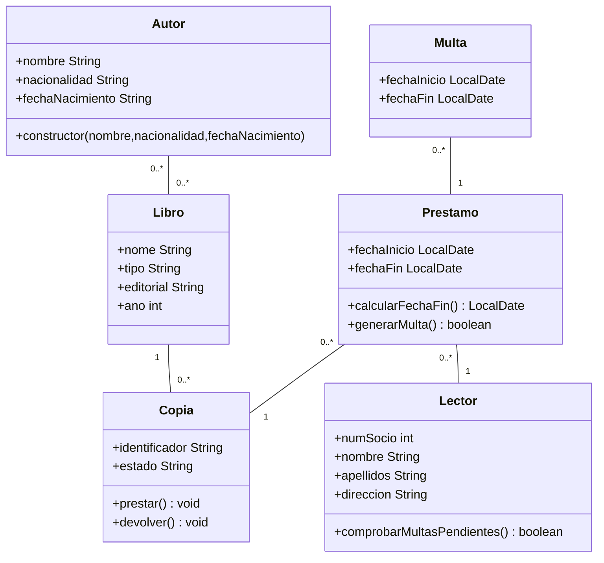

```mermaid
classDiagram
    class Autor {
        +nombre String
        +nacionalidad String
        +fechaNacimiento String

        +constructor(nombre,nacionalidad,fechaNacimiento)
    }

    class Copia {
        +identificador String
        +estado String

        +prestar() void
        +devolver() void
    }

    class Lector {
        +numSocio int
        +nombre String
        +apellidos String
        +direccion String

        +comprobarMultasPendientes() boolean
    }

    class Libro{
        +nome String
        +tipo String
        +editorial String
        +ano int
    }

    class Multa {
        +fechaInicio LocalDate
        +fechaFin LocalDate
    }

    class Prestamo {
        +fechaInicio LocalDate
        +fechaFin LocalDate

        +calcularFechaFin() LocalDate
        +generarMulta() boolean
    }

    Autor "0..*" -- "0..*" Libro
    Libro "1" -- "0..*" Copia
    Prestamo "0..*" -- "1" Copia
    Prestamo "0..*" -- "1" Lector
    Multa "0..*" -- "1" Prestamo 

```