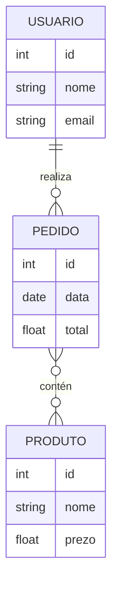

```mermaid
erDiagram
    USUARIO {
        int id
        string nome
        string email
    }

    PEDIDO {
        int id
        date data
        float total
    }

    PRODUTO {
        int id
        string nome
        float prezo
    }

    USUARIO ||--o{ PEDIDO : realiza
    PEDIDO }o--o{ PRODUTO : contén
```