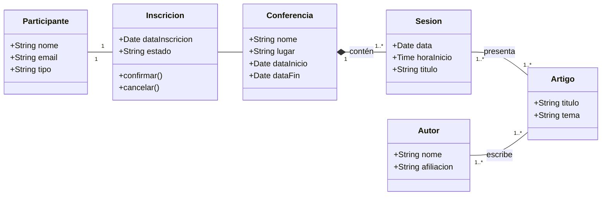

```mermaid
classDiagram

direction LR

class Conferencia {
  +String nome
  +String lugar
  +Date dataInicio
  +Date dataFin
}

class Sesion {
  +Date data
  +Time horaInicio
  +String titulo
}

class Inscricion {
  +Date dataInscricion
  +String estado
  +confirmar()
  +cancelar()
}

class Participante {
  +String nome
  +String email
  +String tipo
}

class Artigo {
  +String titulo
  +String tema
}

class Autor {
  +String nome
  +String afiliacion
}


%% Relacións
Conferencia "1" *-- "1..*" Sesion : contén

Participante "1" -- "1" Inscricion
Inscricion -- Conferencia

Sesion "1..*" -- "1..*" Artigo : presenta

Autor "1..*" -- "1..*" Artigo : escribe
```